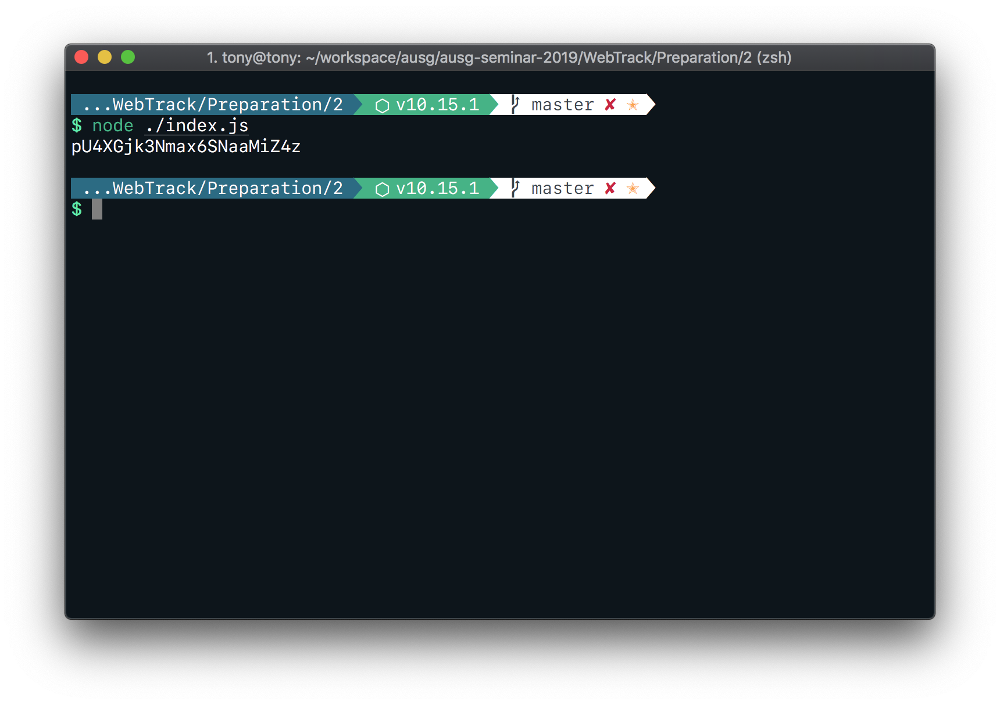

# [실습 2] Node.js 실행해보기

간단하게 따라 써보면서 JavaScript(Node.js) 모듈 시스템을 익힙니다.

### 준비
- 새 폴더를 만듭니다. (폴더 이름은 영문으로)
- 해당 폴더를 VS Code로 엽니다.
  - 설치가 되어있지 않으신 분은 [Visual Studio Code](https://code.visualstudio.com/)에서 설치 파일을 찾을 수 있습니다.
  - VS Code를 열고 해당 창에 폴더를 끌어 놓으면 해당 폴더를 열 수 있습니다.
  - 또는 `File` -> `Open Folder...` 클릭
- `View` -> `Terminal`을 클릭해 터미널 창을 엽니다.

### Node.js 프로젝트 시작하기
- 터미널(CMD) 창에 다음을 입력합니다.
- 나오는 질문에 모두 `Enter`를 누릅니다. (모두 기본값 사용)
```bash
$ npm init
```

### `short-uuid` 라이브러리 설치하기
- 터미널(CMD) 창에 다음을 입력합니다.
```bash
$ npm install short-uuid
```

### generate.js 작성하기
- Visual Studio Code로 
```javascript
const short = require('short-uuid')

const generatedId = short.generate()

// export
module.exports = generatedId
```

### index.js 작성하기
```javascript
const generatedId = require('./generate')

// print
console.log(generatedId)
```

### 실행하기
```bash
$ node ./index.js
```

### 성공
랜덤 ID가 콘솔창에 출력되었다면 성공!

